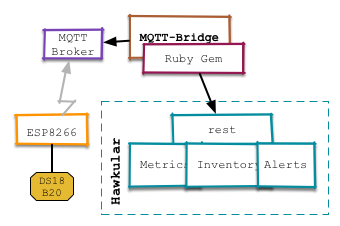

= hawkular-mqtt-bridge

A Ruby Hawkular Client, that accepts data via MQTT and forwards it into Hawkular.
It does this by using the Hawkular-client-Ruby gem.

The bridge registers with the MQTT broker and listens on `/hawkular/+` topics.
Metric arriving on `/hawkular/metrics` are forwarded as such and registration
messages on `/hawkular/register` are used to register the external resource
like an ESP8622 micro controler with a thermo sensor are added to the Hawkular
inventory.

Future versions of the bridge will also be able to set up alerts.

== Registration messages

The following is an example registration message:

[source,json]
include::esp_register_msg.json[An example registration message]